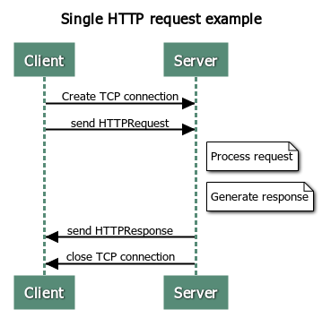
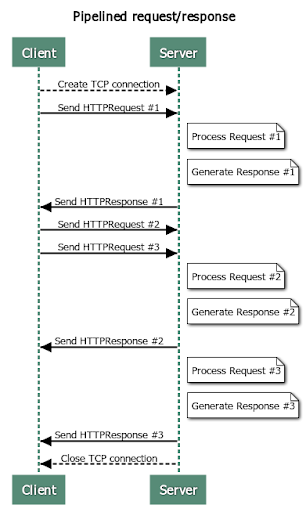

# TritonHTTP

## Overview

This project builds a simple web server that implements a subset of the HTTP/1.1 protocol specification called TritonHTTP.

## Basic Web Server Functionality

At a high level, a web server listens for connections on a socket (bound to a specific port on a host machine). Clients connect to this socket and use the TritonHTTP protocol to retrieve files from the server. Server reads data from the client, using framing and parsing techniques to interpret one or more requests (if the client is using pipelined requests).  Every time the server reads in a full request, it services that request and sends a response back to the client.  After sending back one (or more) responses, the server will either close the connection (if instructed to do so by the client via the “Connection: close” header, described below), or after an appropriate timeout occurs (also described below). The web server then continues waiting for future client connections. The server is implemented in a concurrent manner, so that it can process multiple client requests overlapping in time.

## TritonHTTP Specification

This section describes a minimal subset (which also differs in details) of the HTTP/1.1 protocol specification.

### Client/Server Protocol

TritonHTTP is a client/server protocol that is layered on top of the reliable stream-oriented transport protocol TCP. Clients send request messages to the server, and servers reply with response messages. In its most basic form, a single TritonHTTP-level request/response exchange happens over a single, dedicated TCP connection. The client first connects to the server, and then sends the TritonHTTP request message. The server replies with a TritonHTTP response, and then closes the connection:

Repeatedly setting up and tearing down TCP connections reduces overall network throughput and efficiency, and so TritonHTTP has a mechanism whereby a client can reuse a TCP connection to a given server (HTTP persistent connection). The idea is that the client opens a TCP connection to the server, issues a TritonHTTP request, gets a TritonHTTP response, and then issues another TritonHTTP request on the already open outbound part of the connection. The server replies with the response, and this can continue through multiple request/response interactions. The client signals the last request by setting a “Connection: close” header, described below. The server indicates that it will not handle additional requests by setting the “Connection: close” header in the response. Note that the client can issue more than one TritonHTTP request without necessarily waiting for full HTTP replies to be returned (HTTP pipelining).

To support clients that do not properly set the “Connection: close” header, the server implements a timeout mechanism to know when it should close the connection (otherwise it might just wait forever). For this project, server timeout is set to be 5 seconds. If this timeout occurs and the client has sent part of a request, but not a full request, then the server replies back with a 400 client error (described below). If this timeout occurs and the client has not started sending any part of a new request, the server simply closes the connection.

### HTTP Messages

TritonHTTP request and response messages are plain-text ASCII (the body of a response can also contain binary data). Both requests and responses start with a header section. Responses optionally contain a body section which is separated from the header section by a blank line. The header consists of an initial line (which is different between requests and responses), followed by zero or more key-value pairs. Every line is terminated by a CRLF (carriage-return followed by a line feed, or “\r\n”).

A request message has this form:

<initial request line>[CRLF] 
Key1: value1[CRLF] 
Key2: value2[CRLF] 
… 
KeyN: valueN[CRLF] 
[CRLF]

A response message has this form:

<initial response line>[CRLF] 
Key1: value1[CRLF] 
Key2: value2[CRLF] 
… 
KeyN: valueN[CRLF] 
[CRLF] 
<optional body>

Note that the optional body section is not terminated by a CRLF delimiter. Instead, the end of that body will be indicated via the Content-Length header, described below. There is no specific limit to the size (in bytes) of a request or response message, and no specific limit to the number of key-value pair headers each could contain.

#### Initial Request Line

Line of a TritonHTTP request header has three components:

GET <URL> HTTP/1.1

The method field GET indicates that the client wants to download the content located at the provided URL. Real web servers support other methods such as PUT and POST, which are used to upload data to websites. This project only implements the GET method.

The URL specifies the location of the resource the client is interested in. Examples include /images/myimg.jpg and /employee/index.html. A well-formed URL always starts with a / character. If the slash is missing, server sends back a 400 error. Note that if the URL ends with / like /path/to/dir/, then it is interpreted as if the client requested the URL /path/to/dir/index.html.

The protocol version field takes the form HTTP/x.y, where x.y is the highest version that the client supports. For this project it is HTTP/1.1.

The fully formed initial request line would thus look something like:

GET /images/myimg.jpg HTTP/1.1

#### Initial Response Line

The initial line of a TritonHTTP response also has three components, which are slightly different than those in the request line:

HTTP/1.1 <status code> <status description>

The first term is the highest HTTP version that the server supports, in our case HTTP/1.1.

The next term is a three-digit numeric code indicating the status code of the request (e.g., whether it succeeded or failed, including more fine-grained information about how to interpret this response).

The third term is a human-friendly status description, which can contain spaces.

This project supports the following three response statuses:

200 OK: The request was successful 
400 Bad Request: The client sent a malformed or invalid request that the server doesn’t understand 
404 Not Found: The requested content wasn’t there

The fully formed initial response line would thus look something like:

HTTP/1.1 200 OK

#### Header Lines

After the initial request/response line, the TritonHTTP message can optionally contain zero or more key-value pairs that add additional information about the request or response (called “HTTP Headers”). Some of the keys are specific to the request message, some are specific to response messages, and some can be used with both requests and responses. The exact format of a key-value header is:

<.key.> <.colon.> (<.space.>*) <.value.> <.CRLF.>

The key starts the line, followed by a colon and zero or more spaces, and then the value (each key-value pair is terminated by a CRLF delimiter). <key> is composed of one or more alphanumeric or the hyphen "-" character (i.e. <key> cannot be empty). It is case-insensitive. <value> can be any string not starting with space, and not containing CRLF. It is case-sensitive. As a special case <value> can be an empty string.

Note that when storing the <key> internally, it is converted into the canonical format, where the first letter and any letter following a hyphen is upper case. For example, the canonical format for "content-type" is "Content-Type".

This spec is intentionally different from the actual HTTP/1.1 spec for the purpose of simplification. A few examples:

<ul>
<li>“Content-length: 324\r\n”
  <ul><li>Key: “Content-Length”, value: “324”</li></ul>
</li>
<li>“Content-length:324\r\n”
  <ul><li>Key: “Content-Length”, value: “324”</li></ul>
</li>
<li>“Content-length:        324\r\n”
  <ul><li>Key: “Content-Length”, value: “324”</li></ul>
</li>
</ul>

This project implements and supports the following HTTP headers:

<ul>
<li>Request headers:
  <ul>
  <li>Host (required, 400 client error if not present)</li>
  <li>Connection (optional, if set to “close” then server should close connection with the client after sending response for this request)</li>
  <li>Any other valid request headers that the client sends are gracefully handled. Any request headers not in the proper form (e.g., missing a colon), signal a 400 error. </li>
  </ul>
</li>
<li>Response headers:
  <ul>
  <li>Date</li>
  <li>Last-Modified (required only if return type is 200)</li>
  <li>Content-Type (required only if return type is 200)</li>
  <li>Content-Length (required only if return type is 200)</li>
  <li>Connection: close (returned in response to a client “Connection: close” header, or for a 400 response)</li>
  </ul>
</li>
</ul>

The format for the Date and Last-Modified header is: <day-name>, <day> <month> <year> <hour>:<minute>:<second> GMT. Date refers to the current time on the server.  Last-Modified refers to the time the file being accessed was last modified. For example, we could have:

Last-Modified: Tue, 19 Oct 2021 18:12:55 GMT

#### Message Body

In TritonHTTP, request messages would never have a body, because we only support the GET method. In real-world HTTP, request body might be needed for some other methods.

Our response messages might have a body if it’s a 200 response. In this case, the message body is basically the bytes of the requested file to serve to the client. 400 and 404 messages don’t have a body.

## Virtual Hosting

In some cases, it is desirable to host multiple web servers on a single physical machine. This allows all the hosted web servers to share the physical server’s resources such as memory and processing, and in particular, to share a single IP address. This project implements virtual hosting by allowing TritonHTTP to host multiple servers. Each of these servers has a unique host name and maps to a unique docroot directory on the physical server. Every request sent to TritonHTTP includes the “Host” header, which is used to determine the web server that each request is destined for.

## Spec Summary

Here a concise summary of the TritonHTTP spec is provided.

### HTTP Messages

TritonHTTP follows the [general HTTP message format](https://developer.mozilla.org/en-US/docs/Web/HTTP/Messages). And it has some further specifications:

- HTTP version supported: `HTTP/1.1`
- Request method supported: `GET`
- Response status supported:
  - `200 OK`
  - `400 Bad Request`
  - `404 Not Found`
- Request headers:
  - `Host` (required)
  - `Connection` (optional, `Connection: close` has special meaning influencing server logic)
  - Other headers are allowed, but won't have any effect on the server logic
- Response headers:
  - `Date` (required)
  - `Last-Modified` (required for a `200` response)
  - `Content-Type` (required for a `200` response)
  - `Content-Length` (required for a `200` response)
  - `Connection: close` (required in response for a `Connection: close` request, or for a `400` response)
  - Response headers should be written in sorted order for the ease of testing
  - Response headers should be returned in 'canonical form', meaning that the first letter and any letter following a hyphen should be upper-case. All other letters in the header string should be lower-case.

### Server Logic

When to send a `200` response?
- When a valid request is received, and the requested file can be found.

When to send a `404` response?
- When a valid request is received, and the requested file cannot be found or is not under the doc root.

When to send a `400` response?
- When an invalid request is received.
- When timeout occurs and a partial request is received.

When to close the connection?
- When timeout occurs and no partial request is received.
- When EOF occurs.
- After sending a `400` response.
- After handling a valid request with a `Connection: close` header.

When to update the timeout?
- When trying to read a new request.

What is the timeout value?
- 5 seconds.

## Usage

The source code for tools needed to interact with TritonHTTP can be found in `cmd`. The following commands can be used to launch these tools:

1) `make fetch` - A tool that allows you to construct custom responses and send them to your web server. Please refer to the README in `fetch`'s directory for more information.

2) `make gohttpd` - Starts up Go's inbuilt web-server.

3) `make tritonhttpd`  - Starts up TritonHTTP
